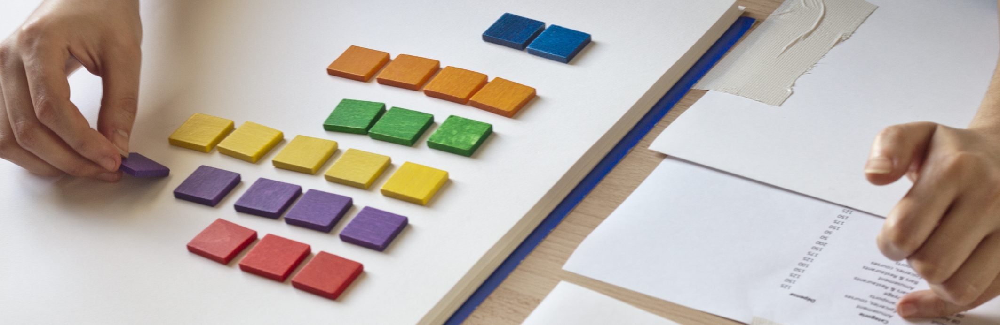
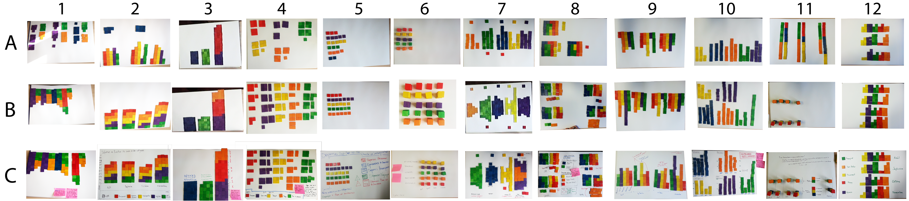

# Home

Warning: This page contains additional material for facilitating the re-analysis, meta-analysis, and replication of our study. If you have questions, feel free to e-mail us.

## Abstract 

The accessibility of infovis authoring tools to a wide audience has been identified as one of the major research challenges. A key task of the authoring process is the development of visual mappings. While the infovis community has long been deeply interested in finding effective visual mappings, comparatively little attention has been placed on how people construct visual mappings. In this paper we present the results of a study designed to shed light on how people spontaneously transform data into visual representations. We asked people to create, update and explain their own information visualizations using simple materials such as tangible building blocks. We learned that all participants, most of whom had no experience in visualization, were readily able to create and talk about their own visualizations. On the basis of our observations, we discuss the actions of our participants in the context of the development of their visual representations and their analytic activities. From this we suggest implications for tool design that can enable broader support for infovis authoring.

## Paper and BibTek 
Hint: To download the paper click <a href="http://hal.inria.fr/hal-01024053" target="_blank">here</a>.

	@article{huron:hal-01024053,
	    hal_id = {hal-01024053},
	    url = {http://hal.inria.fr/hal-01024053},
	    title = {{Constructing Visual Representations: Investigating the Use of Tangible Tokens}},
	    author = {Huron, Samuel and Jansen, Yvonne and Carpendale, Sheelagh},
	    language = {Anglais},
	    affiliation = {AVIZ - INRIA Saclay - Ile de France , Institut de Recherche et d'Innovation - IRI , Fabelier - Fabelier , Department of Computer Science [Calgary] - CPSC},
	    publisher = {IEEE},
	    journal = {IEEE Transactions on Visualization and Computer Graphics},
	    note = {To appear },
	    audience = {internationale },
	    year = {2014},
	}

[gimmick:TwitterFollow](@timodoerr)

## Navigation 

[Setup](setup.md)
[Video](videos.md)
[Photography](photography.md)
[Questionnaires](questionnaires.md)
[Analysis](analysis.md)
[Ressources](ressources.md)
[Previous work](previouswork.md)
[Additional Materials](additional.md)
[Paper](paper.md)
[About](about.md)

