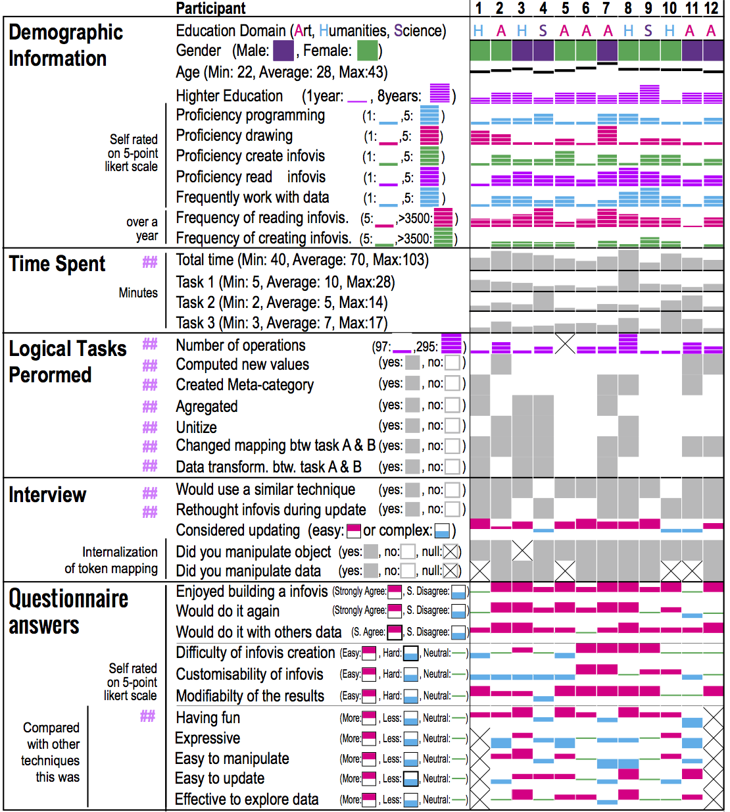
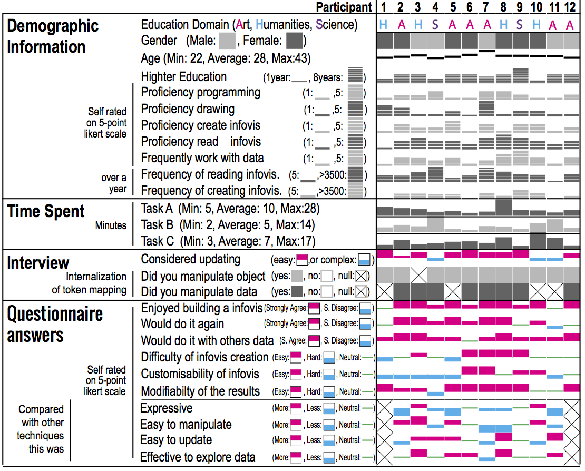

# Questionnaires & Interviews Summary 

Hint: This figures are some custom version of Bertin's Matrice done with the help of  <a href="http://www.bertifier.com/" target="_blank">Bertifier online tool</a>. This tool was published by <a href="http://www.aviz.fr/bertifier" target="_blank">Charle Perin, Pierre Dragicevic and Jean Daniel Fekete</a>  !

Note: To download this figure in PDF click [here](images/bertifier_Matrix-refactoring.pdf).  The line marked with pink &#35;&#35; are not in the paper.

## Mini version

Note: To download this figure in PDF click [here](images/bertifier_Matrix-r-minify.pdf).

<!--
## Formulaire

* [q1 - Pre session questionnaires](https://docs.google.com/forms/d/1owh2KiNtMWS3eXaQPyo-KKkTuNclIpeE2l5IRroUZc4/viewform)

* [i1 - Interview guideline before update]()

* [i2 - Interview guideline after update]()

* [q2 - Post session questionnaires](https://docs.google.com/forms/d/1pKz5tRKRf1y8NtTvPZYdGTgZStyZmm5tRVAWtkxx0y8/edit)

## Participant Reply Raw datas

Warning: Need permission ! Email the autors for access

* [q1 - Pre session questionnaires datas](https://docs.google.com/spreadsheet/ccc?key=0AjsawTO7KwQMdERsbEswanRIX3pCVWFIeUlPbEl4cUE&usp=drive_web)

* [q2 - Post session questionnaires datas](https://docs.google.com/spreadsheet/ccc?key=0AjsawTO7KwQMdGtTTHFGenZNajlycERiUG5ydWpWWGc&usp=drive_web)

## Participant Reply processed datas

Note: Comming Soon !

## Synthesis

Note: Comming Soon !
-->