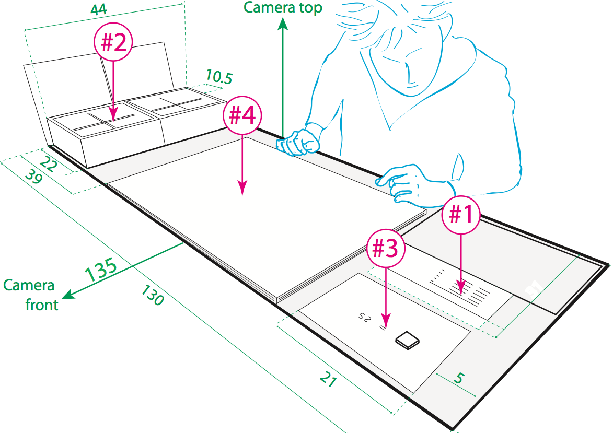
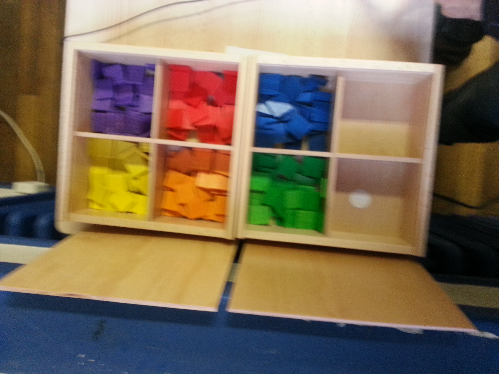
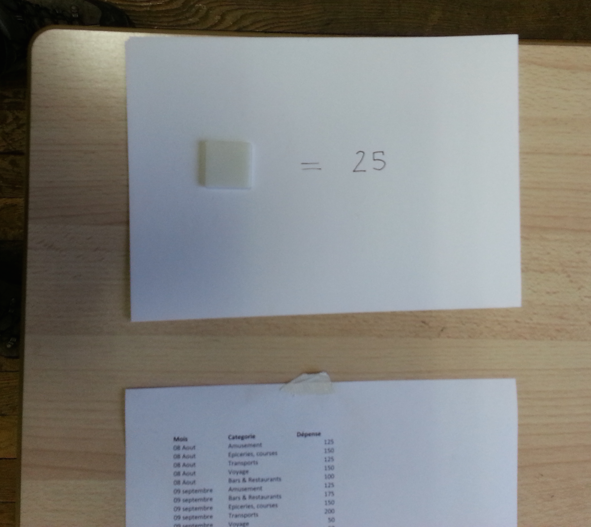
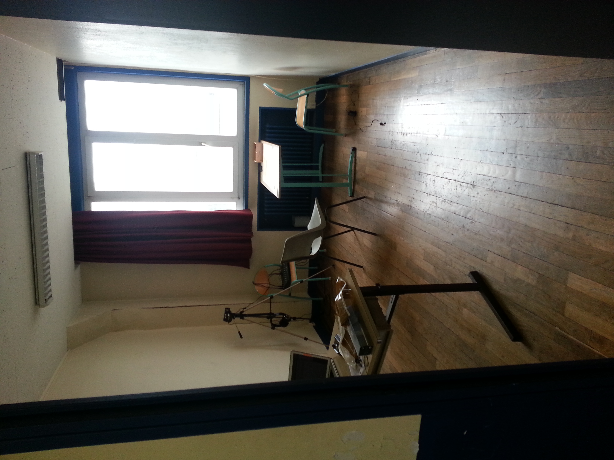
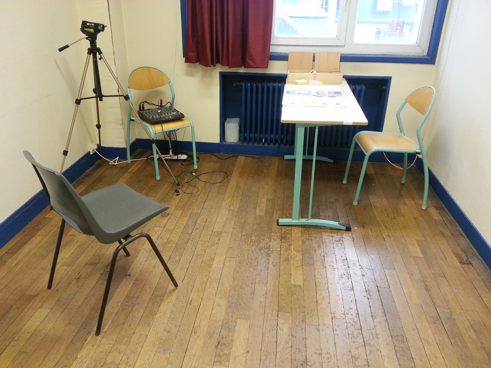
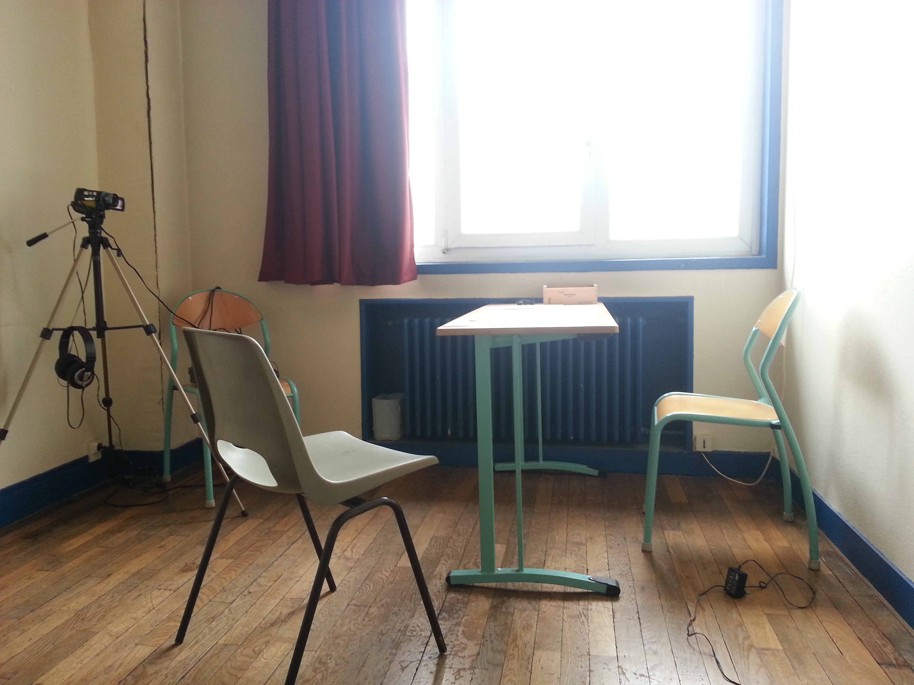
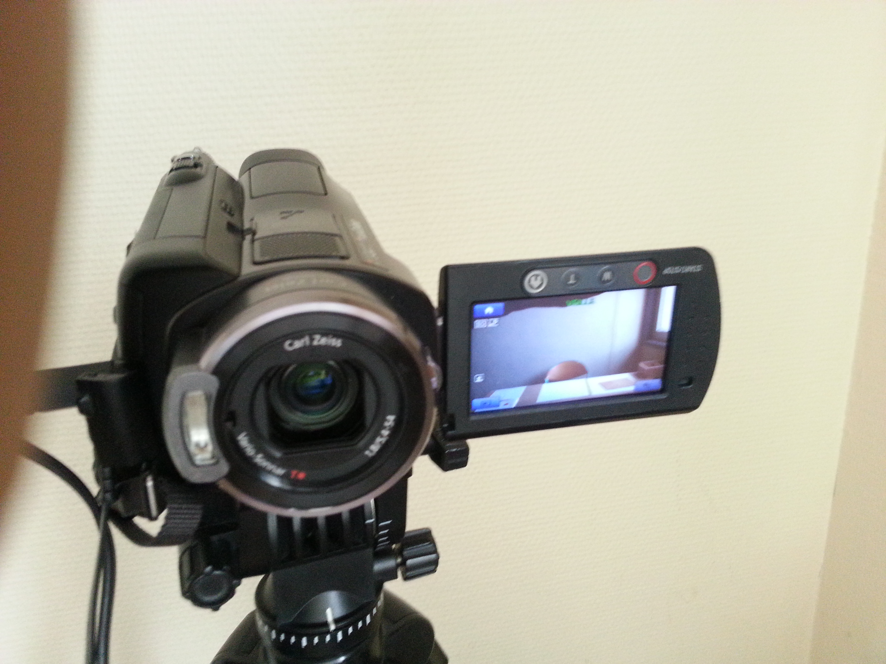
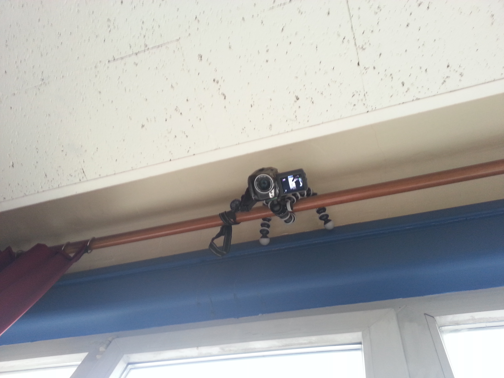
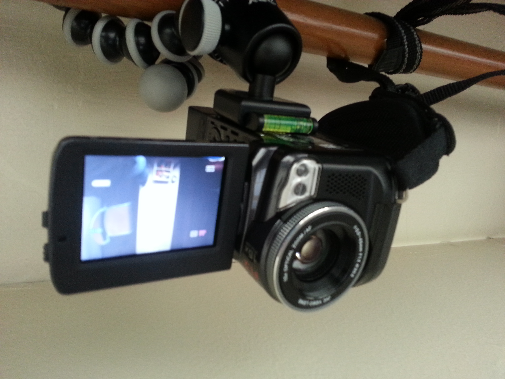
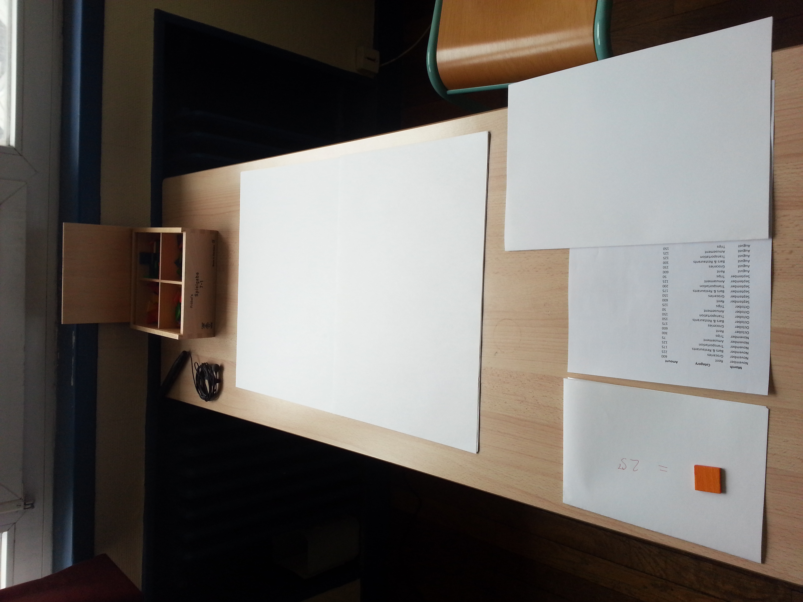

# Setup 

## #1. Printed dataset

File: [Photography of the printed version](images/setup/20131219_184635-dataset-extract.png)

File: [Click here to download a CSV version of the dataset.](ressources/dataset-expe.csv)

## #2. Token Box

File: [Photography of the token box](images/setup/20140130_171643.jpg)

Note: Comming Soon !

## #2.1 Token model
<iframe width="100%" height="300px" class="render-viewer" src="https://render.githubusercontent.com/view/3d?url=https%3A%2F%2Fraw.githubusercontent.com%2Fcybunk%2FFrobel-open-gifts%2Fmaster%2Ftangible-square-printable-model.stl">Viewer requires iframe.</iframe>

File: [Token 3d model](https://github.com/cybunk/Kindergarten-open-gifts/blob/master/tangible-square-printable-model.stl)

## #3. Token Mapping

File: [Photography of the token mapping](images/setup/token-mapping-extract.png)

## #4. a A2 paper canvas

Note: Comming Soon !

## Overall Photos of the setup

   
    

## Download this files

Note: Comming Soon !
